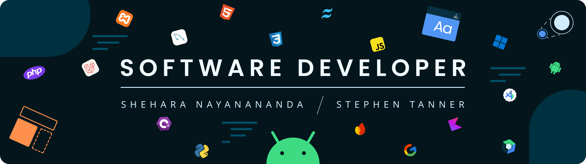
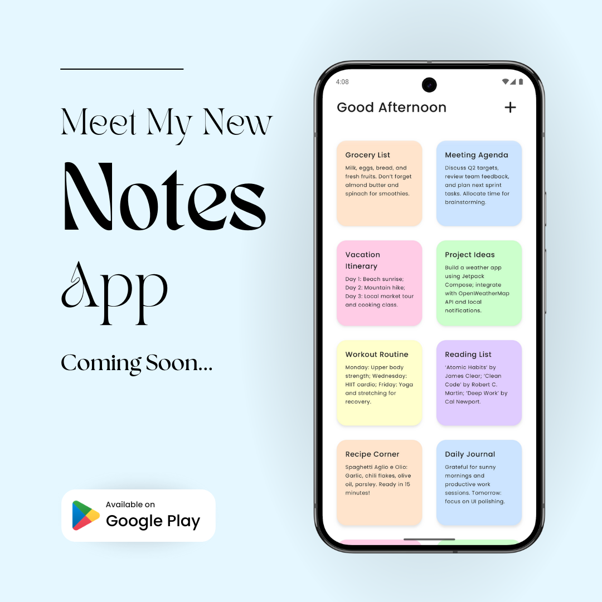
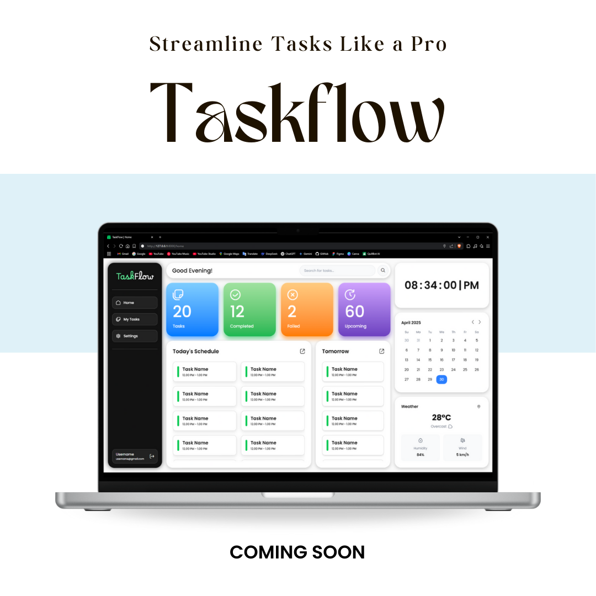
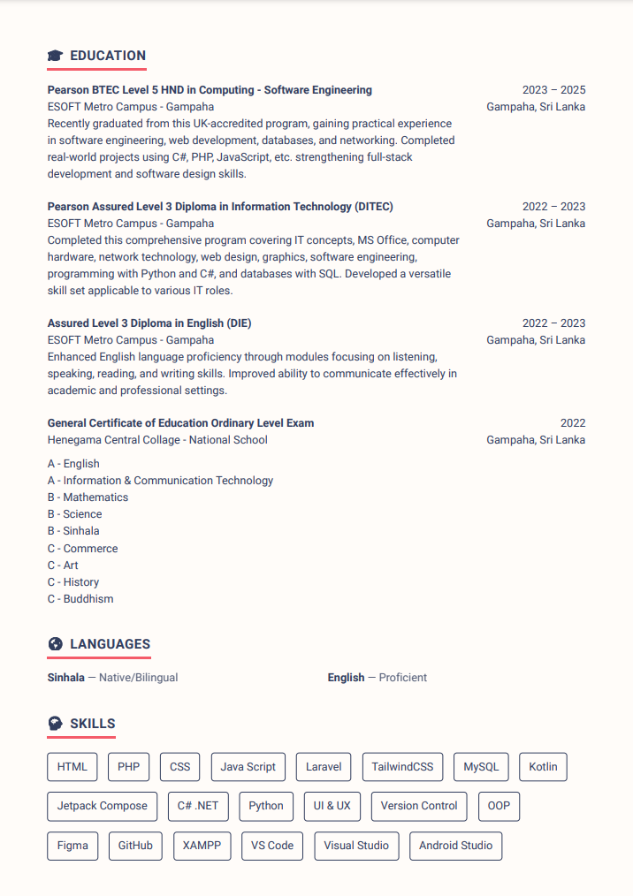

  

# 
Hi There, I'm Shehara Nayanananda 👨🏻‍💻🚀

  
  
  
  
  
  
  
  

 

##  About Me

> "Building software that's simple, beautiful, and solves real problems."

I'm a Full Stack Engineer and Android Developer from Sri Lanka with a passion for creating intuitive applications and elegant solutions. Currently working as a freelance developer, I navigate between web and mobile development while continuously expanding my knowledge in emerging technologies.

- 🚀 Currently building **Notes App** (Android) with Kotlin and Jetpack Compose
- 🌱 Advancing my skills in Android development, MVVM architecture, and AI engineering
- 💼 Working as a Freelance Web & Android Developer
- 🎓 HND in Computing (Software Engineering) graduate
- ⚡ When not coding: Working on side projects and exploring new technologies

 

##  Tech Stack

#### 🎨 Frontend & Design

#### 🛠️ Backend & Database

#### 📱 Mobile Development

#### 🧰 .NET Ecosystem

#### 🔧 Tools & Version Control

 

## 🚀 Current Projects

<table>
  <tr>
    <td width="50%" valign="top">
      <h3 align="center">Notes App 📝</h3>
      

        
        

          
        

        
<strong>Kotlin, Jetpack Compose, Room DB</strong> - A modern notes application with clean UI and intuitive UX.

        
<strong>Expected release: Mid-May 2025.</strong>

      

    </td>
    <td width="50%" valign="top">
      <h3 align="center">Taskify Web App ⌛</h3>
      

        
        

          
        

        
<strong>Laravel, TailwindCSS, MySQL</strong> - A comprehensive task management web application. Currently on hold, planned to resume ASAP.

        
<strong>Expected release: Delayed</strong>

      

    </td>
  </tr>
</table>

 

## ❇️ GitHub Analytics

  
  &nbsp&nbsp
  

 

## 🔄 DevLog

  &nbsp&nbsp
  &nbsp&nbsp
  

  <strong>Apr 2025</strong> — Launched development on my first Android app "Notes" using Kotlin & Jetpack Compose.  
  <strong>Mar 2025</strong> — Temporarily paused **Taskify Web App** (Laravel, Tailwind CSS, MySQL); resuming soon.  
  <strong>Jan 2025</strong> — Completed intensive Android Dev training, focusing on UI/UX & MVVM.

 

## 🔥 Resume

  
  &nbsp&nbsp&nbsp
  

<h3 align="center">
  📄 <a href="docs/resume.pdf">Download full PDF</a>
</h3>

---

  

