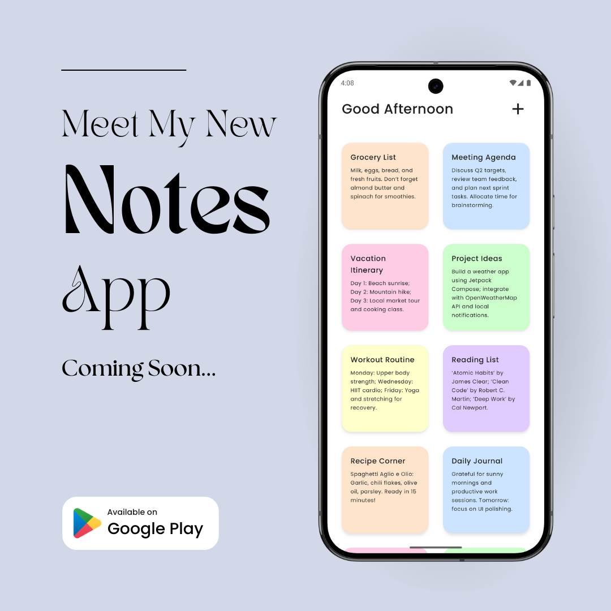

  

# 
Hi There, I'm Shehara Nayanananda 👨🏻‍💻🚀

<!--div align="center">
  
</div-->

  
  
  

 

##  About Me

> "Building software that's simple, beautiful, and solves real problems."

I'm a Full Stack Engineer and Android Developer from Sri Lanka with a passion for creating intuitive applications and elegant solutions. Currently working as a freelance developer, I navigate between web and mobile development while continuously expanding my knowledge in emerging technologies.

- 🚀 Currently building **Notes App** (Android) with Kotlin and Jetpack Compose
- 🌱 Advancing my skills in Android development, MVVM architecture, and AI engineering
- 💼 Working as a Freelance Web & Android Developer
- 🎓 HND in Computing (Software Engineering) graduate
- ⚡ When not coding: Working on side projects and exploring new technologies

 

##  Tech Stack

#### 🎨 Frontend & Design

#### 🛠️ Backend & Database

#### 📱 Mobile Development

#### 🧰 .NET Ecosystem

#### 🔧 Tools & Version Control

 

## 🚀 Current Projects

<table>
  <tr>
    <td width="50%">
      <h3 align="center">Notes App 📝</h3>
      

        
        

          
        

        
<strong>Kotlin, Jetpack Compose, Room DB</strong> - A modern note-taking application with clean UI and intuitive UX. Expected release: Mid-May 2025.

      

    </td>
    <td width="50%">
      <h3 align="center">Taskify Web App ⌛</h3>
      

        
        

          
        

        
<strong>Laravel, TailwindCSS, MySQL</strong> - A comprehensive task management web application. Currently on hold, planned to resume ASAP.

      

    </td>
  </tr>
</table>

 

## 📊 GitHub Analytics

  <!-- GitHub Readme Stats -->
  
  <!-- Top Languages -->
  

 

## 📝 Latest Updates

- **Apr 2025**: Started development on my first Android app "Notes" using Kotlin and Jetpack Compose
- **Mar 2025**: Temporarily paused Taskify Web App development (planned resumption soon)
- **Jan 2025**: Completed comprehensive training in Android Development with UI/UX principles

 

## 🎓 Education

- **HND in Computing (Software Engineering)** - ESOFT Metro Campus, Gampaha (2023-2025)
- **Diploma in Information Technology (DITEC)** - ESOFT Metro Campus, Gampaha (2022-2023)
- **Diploma in English (DIE)** - ESOFT Metro Campus, Gampaha (2022-2023)

 

---

  

  Built with ❤️ by Shehara Nayanananda

