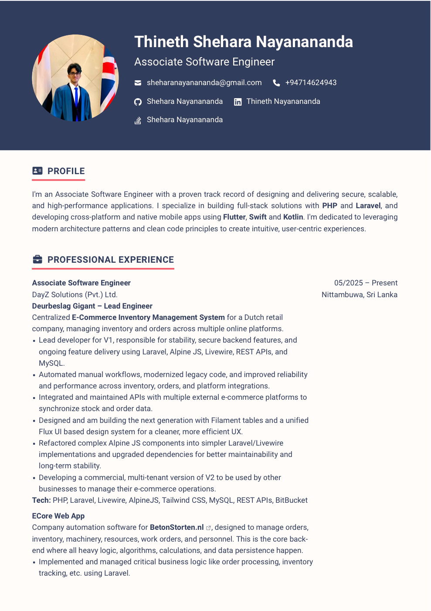
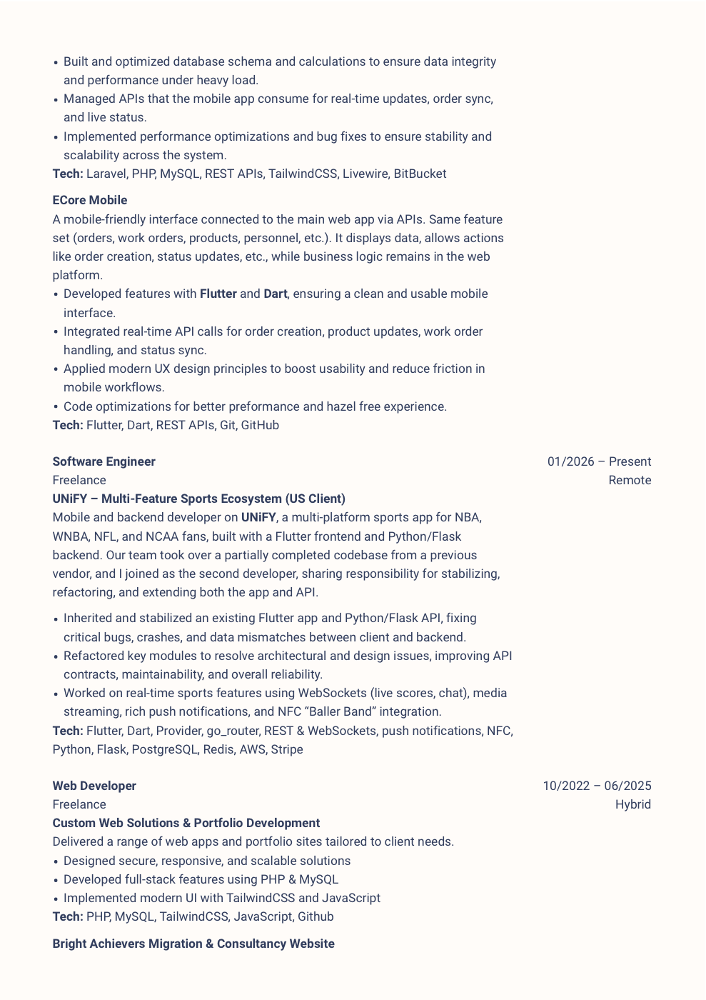
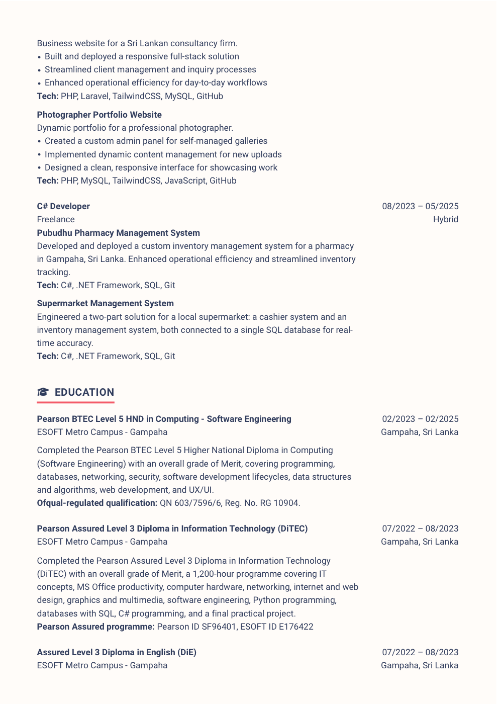
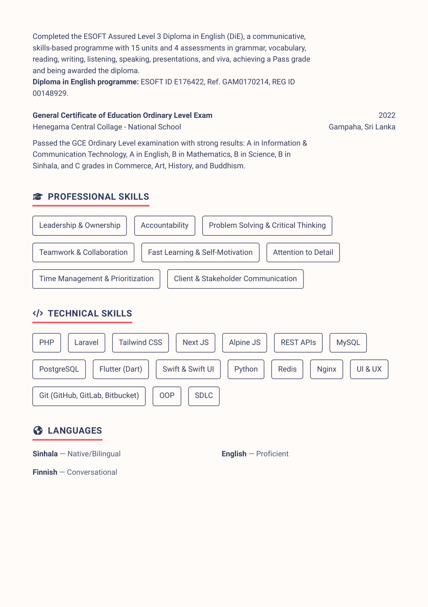

<h1 align="center">Thineth Shehara Nayanananda</h1>

  <strong>Software Engineer | Freelancer</strong> 
  Full-stack and mobile developer building Laravel platforms, Flutter apps, and practical product systems.

  
  
  
  
  

---

## About

I'm a Software Engineer with a proven track record of designing and delivering secure, scalable, and high-performance applications. I specialize in building full-stack solutions with PHP and Laravel, and developing cross-platform and native mobile apps using Flutter, Swift and Kotlin. I'm dedicated to leveraging modern architecture patterns and clean code principles to create intuitive, user-centric experiences.

## Tech Stack

  
  
  
  
  
  
  
  
  
  
  
  
  
  
  
  
  
  
  
  

## Work

<table width="100%">
  <tr>
    <td width="28%"><strong>Associate Software Engineer</strong> DayZ Solutions (Pvt.) Ltd. 05/2025 - Present</td>
    <td>
      <strong>Deurbeslag Gigant – Lead Engineer</strong> 
      Leading V1 stability and secure backend delivery for a centralized e-commerce inventory management platform. Designing V2 with Filament tables and a unified Flux UI design system for a multi-tenant version. 
      PHP / Laravel / Livewire / Alpine JS / Tailwind CSS / MySQL / REST APIs / Bitbucket
        
      <strong>ECore Web App & Mobile</strong> 
      Developed core company automation software and a Flutter-based mobile interface for BetonStorten.nl. Managed complex business logic, real-time API integrations, and database optimizations. 
      Laravel / PHP / MySQL / REST APIs / Tailwind CSS / Livewire / Flutter / Dart
    </td>
  </tr>
  <tr>
    <td width="28%"><strong>Software Engineer</strong> Freelance 01/2026 - Present</td>
    <td>
      <strong>UNiFY – Multi‑Feature Sports Ecosystem</strong> 
      Mobile and backend developer on a multi-platform sports app. Stabilizing, refactoring, and extending a Flutter app and Python/Flask API with real-time features, WebSockets, media streaming, and NFC integration. 
      Flutter / Dart / Provider / go_router / WebSockets / Python / Flask / PostgreSQL / Redis / AWS / Stripe
    </td>
  </tr>
  <tr>
    <td width="28%"><strong>Web Developer</strong> Freelance 10/2022 - 06/2025</td>
    <td>
      <strong>Custom Web Solutions & Portfolio Development</strong> 
      Delivered full-stack solutions including business websites for consultancy firms (Bright Achievers) and dynamic photography portfolios with custom admin panels. 
      PHP / Laravel / MySQL / Tailwind CSS / JavaScript / GitHub
    </td>
  </tr>
  <tr>
    <td width="28%"><strong>C# Developer</strong> Freelance 08/2023 - 05/2025</td>
    <td>
      <strong>Inventory & Supermarket Management Systems</strong> 
      Engineered custom inventory systems for pharmacies and supermarkets, including cashier systems connected to a unified SQL database for real-time accuracy. 
      C# / .NET Framework / SQL / Git
    </td>
  </tr>
</table>

## Education

<table width="100%">
  <tr>
    <td width="28%"><strong>02/2023 - 02/2025</strong> Gampaha, Sri Lanka</td>
    <td>
      <strong>Pearson BTEC Level 5 HND in Computing - Software Engineering</strong> 
      ESOFT Metro Campus - Gampaha 
      Ofqual-regulated qualification QN 603/7596/6
    </td>
  </tr>
  <tr>
    <td width="28%"><strong>07/2022 - 08/2023</strong> Gampaha, Sri Lanka</td>
    <td>
      <strong>Pearson Assured Level 3 Diploma in Information Technology (DiTEC)</strong> 
      ESOFT Metro Campus - Gampaha 
      Pearson Assured programme: Pearson ID SF96401, ESOFT ID E176422
    </td>
  </tr>
  <tr>
    <td width="28%"><strong>07/2022 - 08/2023</strong> Gampaha, Sri Lanka</td>
    <td>
      <strong>Assured Level 3 Diploma in English (DiE)</strong> 
      ESOFT Metro Campus - Gampaha 
      ESOFT ID E176422, Ref. GAM0170214, REG ID 00148929
    </td>
  </tr>
  <tr>
    <td width="28%"><strong>2022</strong> Gampaha, Sri Lanka</td>
    <td>
      <strong>General Certificate of Education Ordinary Level Exam</strong> 
      Henegama Central College - National School 
      
    </td>
  </tr>
</table>

## Resume

  
  
  
  

  <a href="docs/Thineth-Shehara.pdf"><strong>Download the full resume</strong></a>

---

  Building useful software with clean interfaces, strong foundations, and room to scale.

